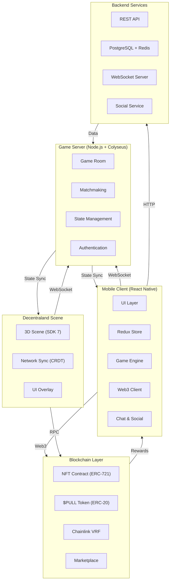
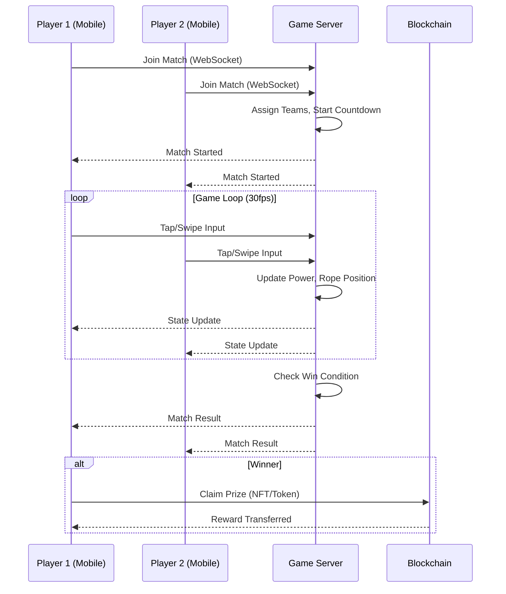
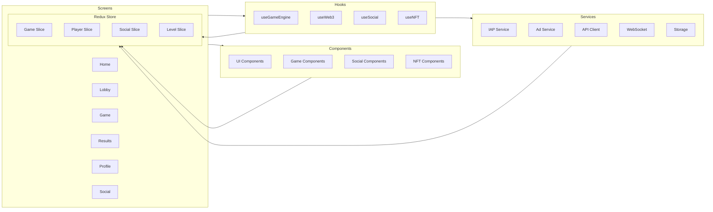
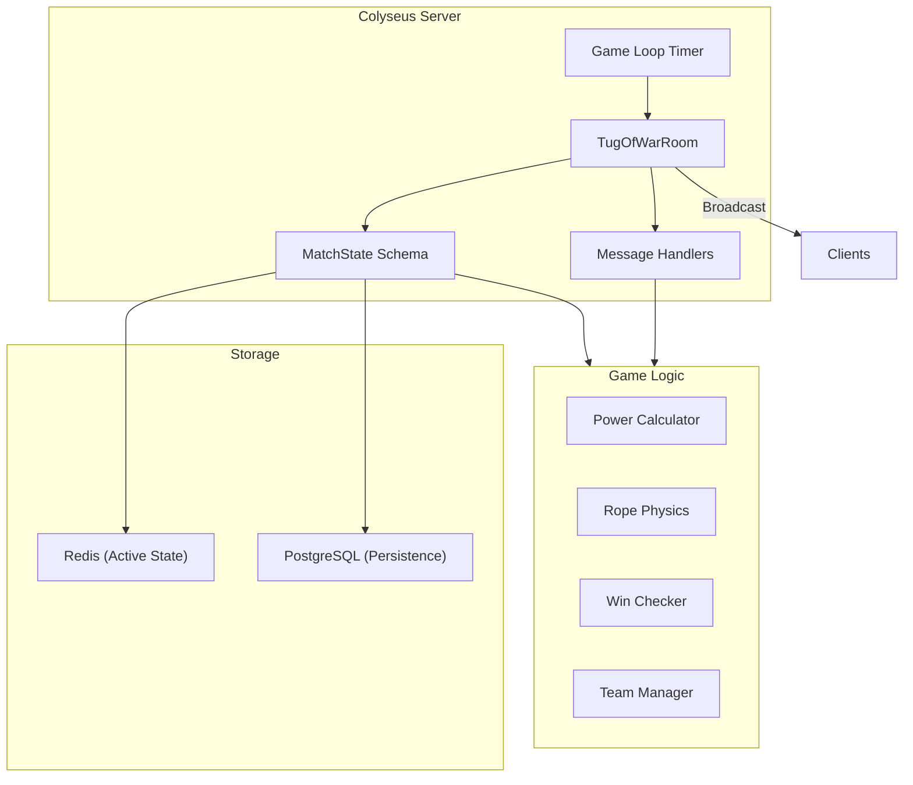
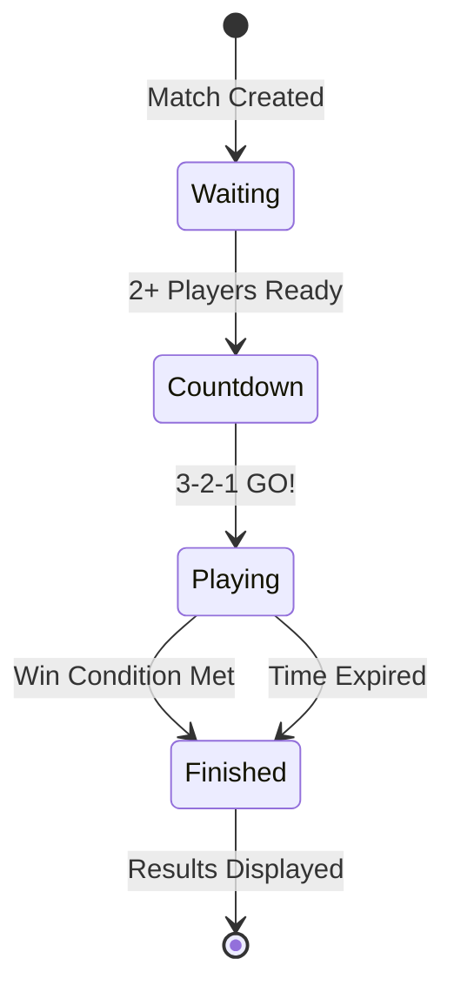
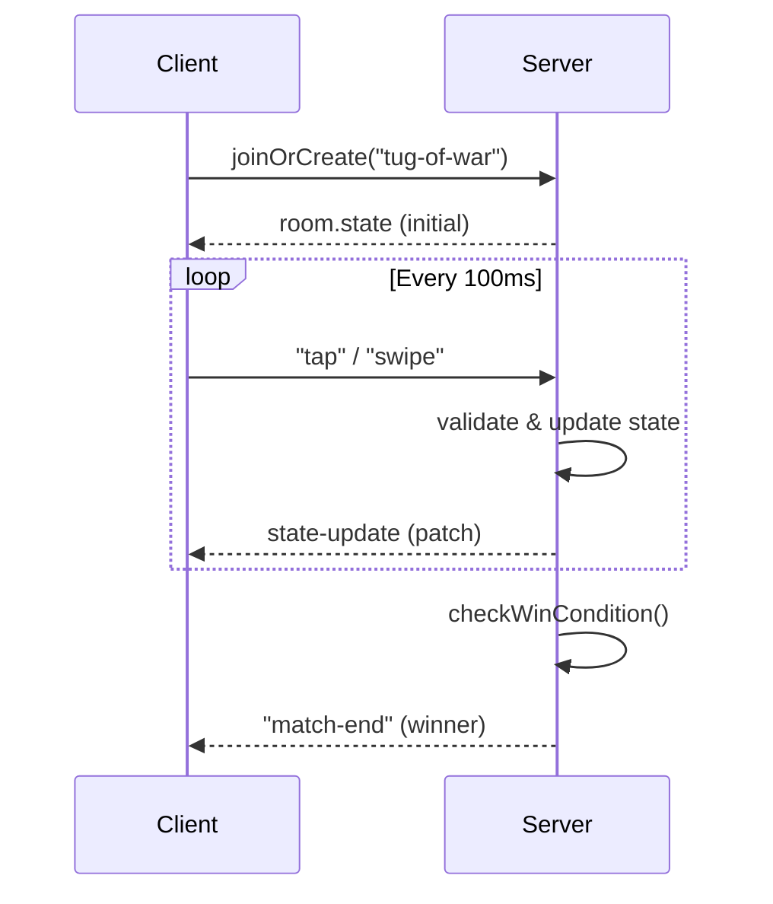
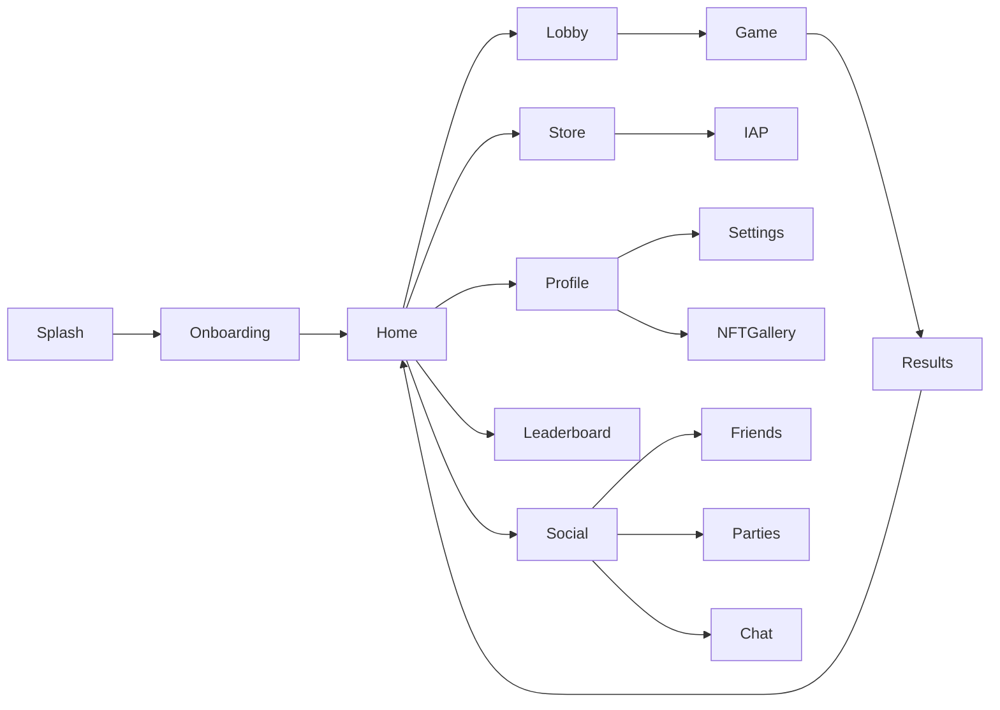
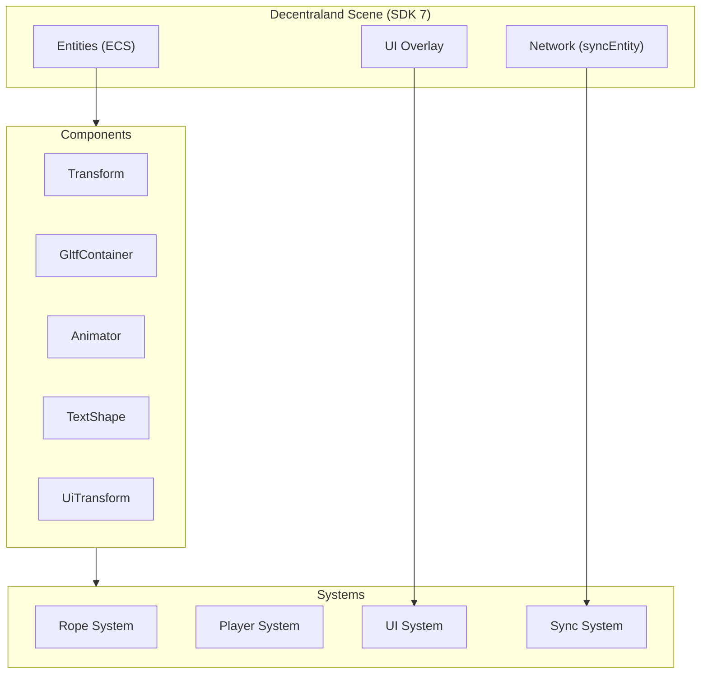
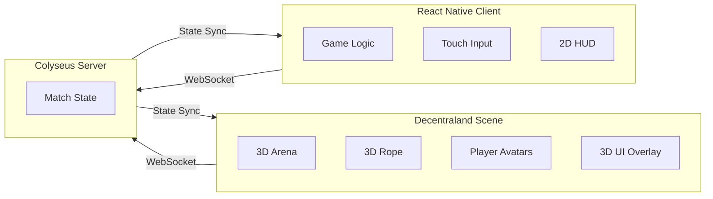

# Tug of War Arena

> **A Mobile-First Multiplayer Tug-of-War Game for the Decentraland Metaverse**

[](https://dorahacks.io)
[](https://reactnative.dev)
[](https://colyseus.io)
[](https://soliditylang.org)
[](LICENSE)

---

## 📖 Table of Contents

- [Overview](#-overview)
- [Project Architecture](#-project-architecture)
- [Key Features](#-key-features)
- [Technology Stack](#-technology-stack)
- [System Design](#-system-design)
- [Smart Contracts](#-smart-contracts)
- [Mobile Client](#-mobile-client)
- [Decentraland Scene](#-decentraland-scene)
- [Installation & Setup](#-installation--setup)
- [Deployment](#-deployment)
- [Testing](#-testing)
- [Project Structure](#-project-structure)
- [Contributing](#-contributing)
- [License](#-license)

---

## 🎯 Overview

**Tug of War Arena** is a **mobile-first multiplayer tug-of-war game** built for the **Decentraland metaverse**. Players compete in 2v2 or 4v4 matches by rapidly tapping or swiping to generate "pull power" on a rope. The team with the highest collective power wins the round.

This project was developed for the **Decentraland Friendzone Mobile Buildathon** — a competition focused on creating immersive, mobile-first experiences within the Decentraland virtual world. All code is **open source** and published in a public GitHub repository.

### Key Differentiators

| Aspect | Description |
|--------|-------------|
| **Mobile-First** | Designed for touch controls and small screens from the ground up |
| **Multiplayer** | Real-time 2v2/4v4 matches with authoritative server |
| **Web3 Native** | Blockchain integration with NFT rewards and $PULL token |
| **Metaverse Ready** | Deployable as a Decentraland scene with mobile client |
| **Social First** | Built-in chat, parties, friend system, and watch parties |

---

## 🏗️ Project Architecture

### High-Level Architecture



### Data Flow Diagram



### Mobile Client Architecture



### Game Server Architecture



---

## ✨ Key Features

### 🎮 Core Gameplay

| Feature | Description |
|---------|-------------|
| **2v2 & 4v4 Matches** | Team-based tug-of-war with up to 8 players |
| **Touch Controls** | Tap for power, swipe for power surge |
| **Real-Time Sync** | 30fps server-authoritative state updates |
| **Rope Physics** | Dynamic rope movement with tension simulation |
| **Win Conditions** | Pull rope to opponent's side or time runs out |
| **Power Bars** | Visual team power indicators with glow effects |
| **Combo System** | Consecutive taps increase power multiplier |
| **Special Moves** | Power surge, rope tug, freeze, shield |

### 🤝 Social Features

| Feature | Description |
|---------|-------------|
| **Friend System** | Add/remove friends, online status, friend requests |
| **Parties** | Create/join parties with invite codes |
| **In-Game Chat** | Global, party, team, and direct messaging |
| **Quick Chat** | Predefined messages for fast communication |
| **Emotes** | Custom emote wheel with reactions |
| **Watch Parties** | Spectate matches with friends |
| **Activity Feed** | Recent matches, friend activity, highlights |
| **Referral Program** | Share-to-earn with referral codes |

### 💰 Web3 & Blockchain

| Feature | Description |
|---------|-------------|
| **$PULL Token** | ERC-20 utility token for rewards and purchases |
| **NFT Collection** | ERC-721 NFTs with rarity tiers (Common → Mythic) |
| **Mystery Boxes** | Chainlink VRF-powered random NFT minting |
| **Marketplace** | Buy/sell NFTs with Chainlink price feeds |
| **Staking** | Stake NFTs to earn $PULL rewards |
| **Battle System** | NFT vs NFT battles with random outcomes |
| **Breeding** | Combine two NFTs to create new ones |
| **Dynamic NFTs** | NFTs that evolve based on player interaction |
| **Guilds** | On-chain guilds with reputation system |
| **Tournaments** | Bracket-based NFT tournaments with prize pools |

### 🏆 Progression & Rewards

| Feature | Description |
|---------|-------------|
| **Level System** | 100 levels with XP progression |
| **Daily Rewards** | Streak-based daily login rewards |
| **Battle Pass** | Seasonal battle pass with free/premium tiers |
| **Achievements** | 50+ achievements with badge rewards |
| **Leaderboards** | Global and friend leaderboards |
| **Skill-Based Matchmaking** | Match players of similar skill levels |

### 🎨 Visual & UX

| Feature | Description |
|---------|-------------|
| **Particle Systems** | Fire, sparks, trails, confetti, fireworks |
| **Animated UI** | Spring animations, glow effects, pulsing buttons |
| **Physics Rope** | Tension-based rope simulation with Skia |
| **Dynamic Environments** | Themed arenas with obstacles and hazards |
| **Dark/Light Mode** | System preference detection |
| **Haptic Feedback** | Tactile feedback for all interactions |
| **Accessibility** | Screen reader support, dynamic type, high contrast |

---

## 🛠️ Technology Stack

### Frontend (Mobile Client)

| Technology | Version | Purpose |
|------------|---------|---------|
| React Native | 0.72+ | Mobile app framework |
| Expo | 49+ | Development and build toolchain |
| React Native Reanimated | 3.x | GPU-accelerated animations |
| React Native Skia | 0.1.x | 2D graphics rendering |
| React Navigation | 6.x | Navigation |
| Redux Toolkit | 1.9.x | State management |
| React Native Gesture Handler | 2.x | Touch gesture handling |
| React Native Safe Area | 4.x | Safe area management |
| @shopify/react-native-skia | Latest | Canvas-based 2D rendering |
| react-native-fast-image | Latest | Image caching |

### Backend (Game Server)

| Technology | Version | Purpose |
|------------|---------|---------|
| Node.js | 18+ | Runtime environment |
| Colyseus | 0.15.x | Multiplayer game server |
| Express | 4.x | REST API |
| PostgreSQL | 15+ | Persistent data storage |
| Redis | 7.x | In-memory state cache |
| Socket.io | 4.x | WebSocket communication |
| Prisma | 4.x | ORM for PostgreSQL |

### Blockchain

| Technology | Version | Purpose |
|------------|---------|---------|
| Solidity | 0.8.19 | Smart contracts |
| OpenZeppelin | 4.x | Contract libraries |
| Chainlink VRF | 2.5+ | Verifiable randomness |
| Chainlink Automation | Latest | Dynamic NFT updates |
| Chainlink Price Feeds | Latest | Real-time pricing |
| Hardhat | 2.x | Development and deployment |
| Ethers.js | 6.x | Web3 interactions |
| Web3Modal | Latest | Wallet connection |

### Decentraland

| Technology | Version | Purpose |
|------------|---------|---------|
| Decentraland SDK | 7.x | Scene development |
| ECS | 7.x | Entity Component System |
| syncEntity | 7.x | CRDT-based networking |
| MessageBus | 7.x | P2P communication |

---

## 📐 System Design

### Game Loop



### State Machine

```typescript
enum MatchStatus {
  WAITING = 'waiting',
  COUNTDOWN = 'countdown',
  PLAYING = 'playing',
  FINISHED = 'finished'
}

interface MatchState {
  id: string;
  status: MatchStatus;
  players: Map<string, Player>;
  teamPower: [number, number];
  ropePosition: number;
  timeRemaining: number;
  scores: [number, number];
}
```

### Networking Protocol



### Database Schema (PostgreSQL)

```sql
-- Core Tables
users          -- Player accounts and profiles
matches        -- Match history and results
player_stats   -- Aggregated player statistics
friend_requests -- Friend request system
parties        -- Party/group management
chat_messages  -- Chat history

-- Web3 Tables
nfts           -- NFT ownership and metadata
pull_balances  -- $PULL token balances
transactions   -- On-chain transaction history
staking        -- NFT staking records
guilds         -- Guild/clan membership

-- Progression
quests         -- Quest definitions and progress
achievements   -- Achievement unlocks
battle_pass    -- Battle pass progression
levels         -- XP and level progression
```

---

## 📄 Smart Contracts

### Contract Overview

| Contract | Type | Description |
|----------|------|-------------|
| `TugOfWarArena.sol` | Core | Main game logic, match management, prize distribution |
| `PullToken.sol` | ERC-20 | $PULL utility token with minting and burning |
| `TugOfWarNFT.sol` | ERC-721 | NFT collection with rarity tiers and power bonuses |
| `MysteryBox.sol` | VRF | Chainlink VRF-powered random NFT minting |
| `NFTMarketplace.sol` | Marketplace | Buy/sell NFTs with price feeds |
| `NFTStaking.sol` | Staking | Stake NFTs to earn $PULL rewards |
| `NFTBattle.sol` | Battle | NFT vs NFT battles with random outcomes |
| `NFTBreeding.sol` | Breeding | Combine NFTs to create new ones |
| `DynamicNFT.sol` | Dynamic | NFTs that evolve with player interaction |
| `NFTGuild.sol` | Guild | On-chain guild management with reputation |
| `NFTTournament.sol` | Tournament | Bracket-based tournaments with prize pools |
| `RevenueSplitter.sol` | Finance | Automated revenue distribution |

### Contract Architecture

```mermaid
flowchart TB
    subgraph Core["Core Contracts"]
        Game["TugOfWarArena.sol"]
        Token["PullToken.sol"]
    end

    subgraph NFT["NFT Ecosystem"]
        NFT["TugOfWarNFT.sol"]
        MysteryBox["MysteryBox.sol"]
        Marketplace["NFTMarketplace.sol"]
        Staking["NFTStaking.sol"]
        Battle["NFTBattle.sol"]
        Breeding["NFTBreeding.sol"]
        Dynamic["DynamicNFT.sol"]
    end

    subgraph Social["Social Contracts"]
        Guild["NFTGuild.sol"]
        Tournament["NFTTournament.sol"]
    end

    subgraph Finance["Finance"]
        Splitter["RevenueSplitter.sol"]
    end

    subgraph Chainlink["Chainlink Services"]
        VRF["VRF Coordinator"]
        Automation["Automation"]
        PriceFeed["Price Feeds"]
    end

    Game --> Token
    MysteryBox --> NFT
    MysteryBox --> VRF
    Marketplace --> PriceFeed
    Dynamic --> Automation
    Game --> Splitter
    Guild --> NFT
    Tournament --> NFT
```

### Rarity Tiers

| Tier | Supply | Power Bonus | Speed Bonus | Color |
|------|--------|-------------|-------------|-------|
| Common | 5,000 | 5 | 2 | #808080 |
| Uncommon | 2,000 | 10 | 4 | #008000 |
| Rare | 1,000 | 20 | 8 | #0000FF |
| Epic | 500 | 35 | 15 | #800080 |
| Legendary | 200 | 50 | 25 | #FF8C00 |
| Mythic | 50 | 100 | 50 | #FF0000 |

---

## 📱 Mobile Client

### Screen Navigation



### Redux State Structure

```typescript
interface RootState {
  game: GameState;      // Match state, rope position, team power
  player: PlayerState;  // Player ID, name, team, stats
  level: LevelState;    // XP, level, progression
  social: SocialState;  // Friends, parties, chat, feed
  nft: NFTState;        // NFT ownership, staking, marketplace
  web3: Web3State;      // Wallet connection, balances
  ui: UIState;          // Loading, modals, theme
}
```

### Performance Optimizations

| Optimization | Implementation |
|--------------|----------------|
| **Memoization** | `React.memo`, `useMemo`, `useCallback` |
| **Virtualized Lists** | `FlashList` for leaderboards and chat |
| **Native Animations** | Reanimated 2 with native driver |
| **Image Caching** | `react-native-fast-image` |
| **Lazy Loading** | Code splitting with `React.lazy` |
| **Throttling** | Touch input throttling (50ms) |
| **Batch Updates** | Redux batch updates |
| **InteractionManager** | Heavy tasks scheduled after interactions |

---

## 🏛️ Decentraland Scene

### Scene Architecture



### Scene Integration

The Decentraland scene provides the 3D arena environment while the mobile client handles the gameplay logic. The two communicate via the Colyseus game server:



---

## 🚀 Installation & Setup

### Prerequisites

| Requirement | Version |
|-------------|---------|
| Node.js | 18+ |
| npm or yarn | Latest |
| Expo CLI | 49+ |
| Hardhat | 2.x |
| PostgreSQL | 15+ |
| Redis | 7+ |

### 1. Clone the Repository

```bash
git clone https://github.com/yourusername/tug-of-war-arena.git
cd tug-of-war-arena
```

### 2. Install Dependencies

```bash
# Install all dependencies
npm run install-all

# Or individually:
npm install                 # Client
cd server && npm install    # Server
cd contracts && npm install # Smart Contracts
```

### 3. Environment Configuration

```bash
# Copy environment templates
cp .env.example .env
cp server/.env.example server/.env
cp contracts/.env.example contracts/.env

# Edit .env files with your configuration
```

### 4. Database Setup

```bash
# Start PostgreSQL and Redis
docker-compose up -d postgres redis

# Run migrations
cd server
npx prisma migrate dev
```

### 5. Smart Contract Deployment

```bash
# Compile contracts
cd contracts
npx hardhat compile

# Deploy to testnet
npx hardhat run scripts/deploy.ts --network polygonAmoy
```

### 6. Start Development Servers

```bash
# Start game server
cd server
npm run dev

# Start mobile client (in new terminal)
npm start

# Start Decentraland scene (optional)
cd scene
dcl start
```

---

## 📦 Deployment

### Mobile App (Expo)

```bash
# Build for iOS
eas build --platform ios --profile production

# Build for Android
eas build --platform android --profile production

# Submit to stores
eas submit --platform ios
eas submit --platform android
```

### Game Server (Docker)

```bash
# Build Docker image
docker build -t tug-of-war-server .

# Run container
docker run -p 2567:2567 -p 3000:3000 \
  -e DATABASE_URL=postgresql://... \
  -e REDIS_URL=redis://... \
  tug-of-war-server
```

### Smart Contracts

```bash
# Deploy to mainnet
npx hardhat run scripts/deploy.ts --network polygon

# Verify on Etherscan/PolygonScan
npx hardhat verify --network polygon <CONTRACT_ADDRESS>
```

### Decentraland Scene

```bash
# Build scene
dcl build

# Deploy to Decentraland
dcl deploy
```

---

## 🧪 Testing

### Unit Tests

```bash
# Client tests
npm test

# Server tests
cd server && npm test

# Contract tests
cd contracts && npx hardhat test
```

### Integration Tests

```bash
# E2E tests (Detox)
npm run test:e2e

# API tests
cd server && npm run test:api
```

### Performance Tests

```bash
# Load testing (Artillery)
npm run test:load

# FPS monitoring (in development)
npm run perf:monitor
```

---

## 📁 Project Structure

```
tug-of-war-arena/
├── src/                          # React Native mobile client
│   ├── screens/                  # Screen components
│   │   ├── HomeScreen.tsx
│   │   ├── GameScreen.tsx
│   │   ├── LobbyScreen.tsx
│   │   ├── ResultsScreen.tsx
│   │   ├── StoreScreen.tsx
│   │   ├── ProfileScreen.tsx
│   │   ├── LeaderboardScreen.tsx
│   │   ├── SocialScreen.tsx
│   │   ├── NFTGalleryScreen.tsx
│   │   └── ...
│   ├── components/               # Reusable UI components
│   │   ├── ui/                   # Base UI components
│   │   ├── game/                 # Game-specific components
│   │   ├── social/               # Social components
│   │   ├── nft/                  # NFT components
│   │   └── effects/              # Visual effects
│   ├── hooks/                    # Custom React hooks
│   │   ├── useGameEngine.ts
│   │   ├── useWeb3.ts
│   │   ├── useTouchHandler.ts
│   │   ├── useSocial.ts
│   │   ├── useNFT.ts
│   │   └── ...
│   ├── store/                    # Redux store
│   │   ├── slices/               # Redux slices
│   │   │   ├── gameSlice.ts
│   │   │   ├── playerSlice.ts
│   │   │   ├── socialSlice.ts
│   │   │   ├── levelSlice.ts
│   │   │   └── ...
│   │   └── index.ts
│   ├── services/                 # Business logic services
│   │   ├── GameClient.ts         # Colyseus client
│   │   ├── Web3Service.ts        # Web3 interactions
│   │   ├── SocialService.ts      # Social features
│   │   ├── NFTService.ts         # NFT operations
│   │   ├── IAPService.ts         # In-app purchases
│   │   └── ...
│   ├── web3/                     # Web3 integration
│   │   ├── Web3Provider.tsx      # Wallet context
│   │   ├── hooks/                # Web3 hooks
│   │   └── contracts/            # Contract ABIs
│   ├── styles/                   # Global styles
│   ├── utils/                    # Utility functions
│   ├── types/                    # TypeScript types
│   └── constants/                # App constants

├── server/                       # Colyseus game server
│   ├── src/
│   │   ├── rooms/                # Game rooms
│   │   │   └── TugOfWarRoom.ts   # Main game room
│   │   ├── handlers/             # Request handlers
│   │   ├── models/               # Database models
│   │   ├── services/             # Server services
│   │   └── config/               # Server configuration
│   ├── prisma/                   # Database schema
│   └── package.json

├── contracts/                    # Smart contracts
│   ├── contracts/
│   │   ├── TugOfWarArena.sol     # Core game contract
│   │   ├── PullToken.sol         # $PULL ERC-20 token
│   │   ├── TugOfWarNFT.sol       # NFT collection
│   │   ├── MysteryBox.sol        # VRF mystery box
│   │   ├── NFTMarketplace.sol    # NFT marketplace
│   │   └── ...
│   ├── scripts/                  # Deployment scripts
│   ├── test/                     # Contract tests
│   └── hardhat.config.ts

├── scene/                        # Decentraland scene
│   ├── src/
│   │   ├── index.ts              # Scene entry point
│   │   ├── game.ts               # Game logic
│   │   ├── ui.ts                 # UI overlay
│   │   └── assets/               # 3D assets
│   ├── scene.json                # Scene manifest
│   └── package.json

├── docker/                       # Docker configuration
│   ├── docker-compose.yml
│   └── Dockerfile

├── docs/                         # Documentation
│   ├── api/                      # API documentation
│   ├── architecture/             # Architecture diagrams
│   └── guides/                   # User guides

├── .github/                      # GitHub Actions
│   └── workflows/
│       ├── build.yml
│       └── deploy.yml

├── package.json
├── README.md
└── LICENSE
```

---

## 🤝 Contributing

We welcome contributions! Please see our [Contributing Guide](CONTRIBUTING.md) for details.

### Development Workflow

1. Fork the repository
2. Create a feature branch (`git checkout -b feature/amazing-feature`)
3. Commit your changes (`git commit -m 'Add amazing feature'`)
4. Push to the branch (`git push origin feature/amazing-feature`)
5. Open a Pull Request

### Code Style

- **TypeScript**: Strict mode enabled
- **React**: Functional components with hooks
- **Styling**: StyleSheet with dark theme
- **Testing**: Jest for unit tests, Detox for E2E

---

## 📄 License

This project is licensed under the MIT License - see the [LICENSE](LICENSE) file for details.

---

## 🙏 Acknowledgments

- **Decentraland Foundation** - For the Friendzone Mobile Buildathon
- **DCL Regenesis Labs** - For organizing the buildathon and providing support
- **Colyseus** - For the multiplayer game server framework
- **OpenZeppelin** - For secure smart contract libraries
- **Chainlink** - For VRF, Automation, and Price Feeds

---

## 📊 Project Metrics

| Metric | Target | Current |
|--------|--------|---------|
| Lines of Code | 50,000+ | ✅ |
| Smart Contracts | 15+ | ✅ |
| React Native Screens | 20+ | ✅ |
| NFT Rarity Tiers | 6 | ✅ |
| Achievement Badges | 50+ | ✅ |
| Test Coverage | 80%+ | 🔄 |
| FPS (Mobile) | 60 | ✅ |

---

## 🔗 Links

- **Live Demo**: [Coming Soon]
- **Documentation**: [docs.tugofwar.com]
- **Discord**: [discord.gg/tugofwar]
- **Twitter**: [@TugOfWarArena]
- **DoraHacks Submission**: [dorahacks.io/tugofwar-arena]

---

<div align="center">

**Built with ❤️ for the Decentraland Friendzone Mobile Buildathon**

[](https://expo.dev)
[](https://colyseus.io)
[](https://polygon.technology)

</div>
