# Tug of War Arena: Friendzone

> **A hybrid Friendzone experience: a React Native mobile companion plus a real Decentraland SDK7 3D World, sharing one social domain. Web3 is optional.**

The native Decentraland client currently **does not run on mobile devices**. This repository does **not** treat the React Native screens as the World. The World is `decentraland-world/` (SDK7). The Expo app is the portrait companion.

.png?raw=true)

[](https://reactnative.dev/)
[](https://expo.dev/)
[](https://www.typescriptlang.org/)
[](https://trpc.io/)
[](https://vitest.dev/)
[](LICENSE)

---

## Table of Contents

* [Overview](#overview)
* [Why Tug of War Arena](#why-tug-of-war-arena)
* [Friendzone Upgrade](#friendzone-upgrade)
* [Core Experience](#core-experience)
* [Social Loop](#social-loop)
* [Product Principles](#product-principles)
* [Architecture](#architecture)
* [Architecture at a Glance](#architecture-at-a-glance)
* [Client Architecture](#client-architecture)
* [Domain Architecture](#domain-architecture)
* [Server Architecture](#server-architecture)
* [Data Model](#data-model)
* [State Machine](#state-machine)
* [Game Mechanics](#game-mechanics)
* [Friendzone Mechanics](#friendzone-mechanics)
* [Mobile UX](#mobile-ux)
* [Accessibility](#accessibility)
* [Offline-First Reliability](#offline-first-reliability)
* [Networking](#networking)
* [Deep Links and World Bridging](#deep-links-and-world-bridging)
* [Persistence and Migrations](#persistence-and-migrations)
* [Analytics and Telemetry](#analytics-and-telemetry)
* [Performance Strategy](#performance-strategy)
* [Security and Trust Boundaries](#security-and-trust-boundaries)
* [Project Structure](#project-structure)
* [Important Files](#important-files)
* [Implementation Details](#implementation-details)
* [Running Locally](#running-locally)
* [Environment Configuration](#environment-configuration)
* [Development Workflow](#development-workflow)
* [Testing](#testing)
* [Mobile QA Checklist](#mobile-qa-checklist)
* [Production Multiplayer Path](#production-multiplayer-path)
* [Decentraland Integration Strategy](#decentraland-integration-strategy)
* [3D Arena Scene](#3d-arena-scene)
* [Demo Mode](#demo-mode)
* [Hackathon Demo Script](#hackathon-demo-script)
* [Submission Positioning](#submission-positioning)
* [Limitations and Honest Scope](#limitations-and-honest-scope)
* [Roadmap](#roadmap)
* [Contributing](#contributing)
* [License](#license)

---

## Overview

Tug of War Arena: Friendzone is a **hybrid** product:

1. **React Native mobile companion** — crew, rooms, missions, social, wallet status, World preview
2. **Decentraland SDK7 3D World** — spawn plaza, arena, rope, bases, boards, governance, achievements
3. **Shared Friendzone domain** — players, rooms, matches, missions, social state
4. **Optional blockchain layer** — match proof after play, never a prerequisite

The portrait Expo app is a companion. The 3D destination is `decentraland-world/` (SDK7). A compatibility plaza also exists in `scene/`.

.png?raw=true)
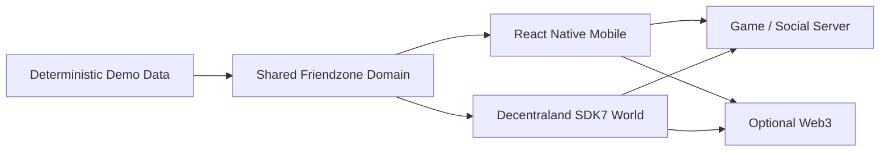

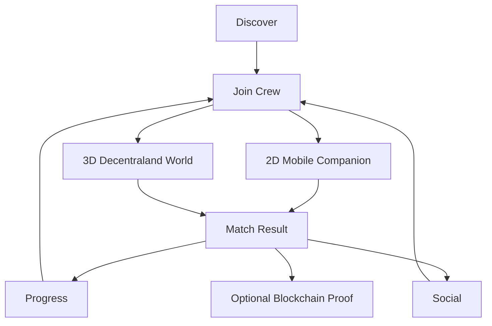

See `docs/MOBILE_3D_HYBRID_ARCHITECTURE.md`, `docs/DECENTRALAND_WORLD_ARCHITECTURE.md`, `docs/WALLET_RUNTIME_ARCHITECTURE.md`, and `docs/FINAL_DEMO_RUNBOOK.md`.

---

* room creation and joining
* invite codes
* share/copy invite flows
* player presence
* crew reactions
* one-thumb gameplay
* streak feedback
* match recaps
* daily missions
* leaderboard presentation
* retention prompts
* offline-first local state
* network health feedback
* deep-link parsing/building
* a multiplayer API boundary
* an offline action queue
* analytics and telemetry primitives
* deterministic domain tests

The architecture intentionally separates UI, domain logic, persistence, network access, and server concerns. The goal is to make the project easy to demonstrate today and easy to replace with production services later. A Decentraland SDK 7 scene in `scene/` is the in-world spectacle layer for the same pull rules.

---

## Why Tug of War Arena

Tug-of-war is useful as a mobile interaction because the core mechanic requires almost no explanation:

1. Choose a side.
2. Press the pull control.
3. Build momentum.
4. Beat the opposing side.
5. Celebrate.

That simplicity creates room for the social product layer to carry the complexity.

Instead of building a game that only answers **“Can I win?”**, this project asks:

> **“Can I create a reason for my friends to join me, react to me, and come back for another round?”**

That becomes the design philosophy behind the Friendzone upgrade.

---

## Friendzone Upgrade

The current repository includes a dedicated **Crew** experience alongside the original Home arena.

The upgrade was designed as an additive layer so the existing arena is preserved as a safe fallback/demo path.

### Added client surfaces

| Surface        | Purpose                                   |
| -------------- | ----------------------------------------- |
| Crew tab       | Main Friendzone social hub                |
| Party panel    | Create/join a room and manage invite flow |
| Presence strip | Make nearby crew visible                  |
| Reaction bar   | Low-friction social signaling             |
| Mobile arena   | Large-touch competitive loop              |
| Mission card   | Daily engagement and return behavior      |
| Match recap    | Clear outcome + progress feedback         |
| Leaderboard    | Lightweight social proof                  |
| Network health | Honest online/offline state               |
| Retention card | Explicit next-action / rematch loop       |

### Added domain capabilities

The `lib/friendzone/` module is intentionally dependency-light and contains reusable game/social primitives instead of putting all logic inside React components.

The current module set covers:

* domain types
* constants
* stable identifiers
* deterministic clocks
* validation
* scoring
* streaks
* daily missions
* reactions
* party logic
* leaderboard logic
* retention signals
* analytics events
* accessibility helpers
* performance budgets
* persistence
* migrations
* reducers
* selectors
* actions
* sharing
* network health
* HTTP network client
* seeded demo data
* profile management
* Friendzone bridge/deep links
* offline outbox queue
* typed errors
* feature flags
* local telemetry

---

## Core Experience

The app has two complementary modes.

### Home

The original project experience remains available at the Home tab. This provides a familiar fallback and preserves the initial gameplay concept.

### Crew

The Friendzone Crew screen turns the game into a social surface. A typical session looks like:

```text
Open app
  ↓
Load local player state
  ↓
Open Crew
  ↓
Create / join room
  ↓
Share invite
  ↓
See presence
  ↓
Send reaction
  ↓
Choose Sun or Moon
  ↓
Enter one-thumb arena
  ↓
Build streak
  ↓
Finish match
  ↓
Update missions + stats
  ↓
Read recap
  ↓
Return to crew
  ↓
Invite / react / rematch
```

The important product decision is that the match is not treated as the end of the experience. The match is the center of the loop.

---

## Social Loop

The Friendzone layer is designed around a repeatable loop:

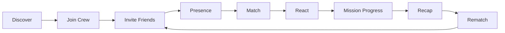

### Why the loop matters

A competitive mini-game can be entertaining but still have low retention if the experience ends immediately after the result.

This project adds explicit post-match state:

* the player sees what happened
* statistics are updated
* mission progress changes
* a personal best can be highlighted
* the player can react
* the player can return to the crew
* the room can be reused
* invitations remain one interaction away

The result is a product loop rather than a single interaction.

---

## Product Principles

### 1. One-thumb first

The most important gameplay action should work with one hand, in portrait orientation, without precision gestures.

### 2. Social state should be visible

A player should not need to enter several screens to understand whether friends are around, whether a room exists, or whether the session is active.

### 3. Offline should degrade gracefully

A network issue should reduce multiplayer capabilities without making the local demo unusable.

### 4. Every color has a semantic backup

Status and actions also use text, labels, icons, or explicit state descriptions.

### 5. The domain should not depend on React

Game rules and social transformations live in plain TypeScript modules whenever practical. This keeps business logic testable and portable.

### 6. Demo reliability beats architectural theatre

The repository contains clear seams for production services, but the default demonstration path avoids making a working demo dependent on infrastructure that may not be available during judging.

---

# Architecture

## Architecture at a Glance

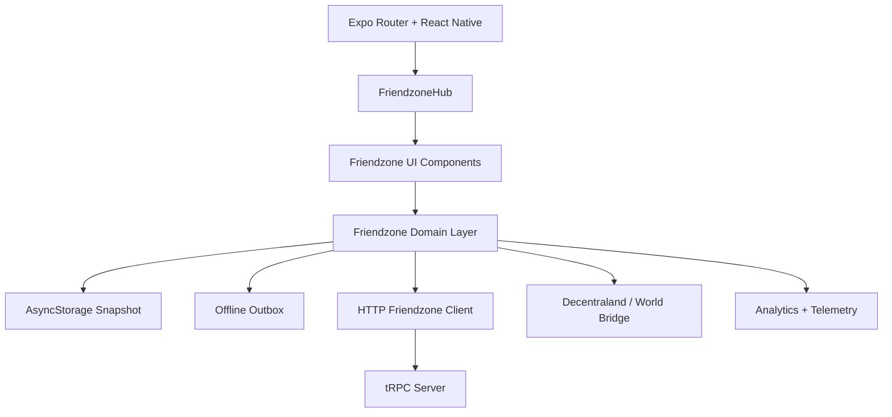

### Hybrid runtime

```text
                  TUG OF WAR ARENA
                         │
          ┌──────────────┴──────────────┐
          │                             │
   MOBILE COMPANION              DECENTRALAND WORLD
     React Native / Expo            SDK7 / 3D
          │                             │
     Crew / Rooms                 Arena / Rope
     Wallet UI                    3D Players
     2D World Map                 Events / Missions
          │                             │
          └──────────────┬──────────────┘
                         │
                   SHARED WORLD FEED
                         │
                  OPTIONAL WEB3
                         │
                WALLET / MATCH PROOF
```

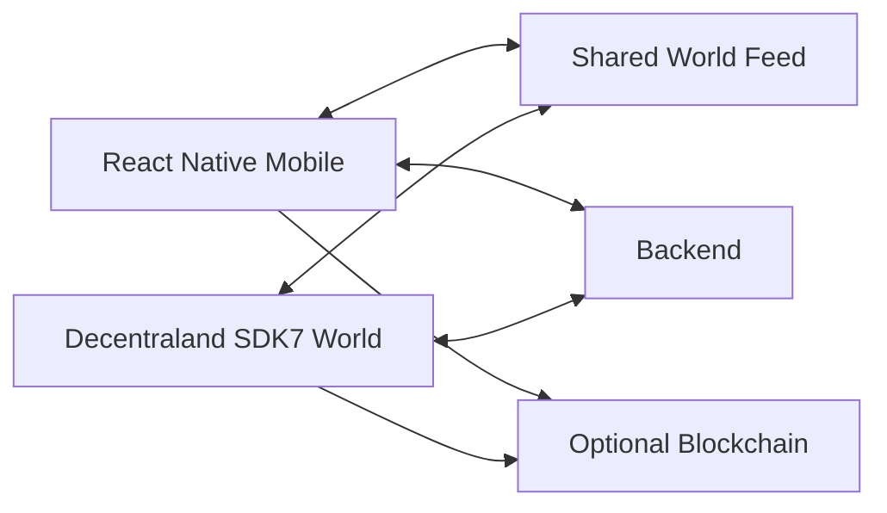

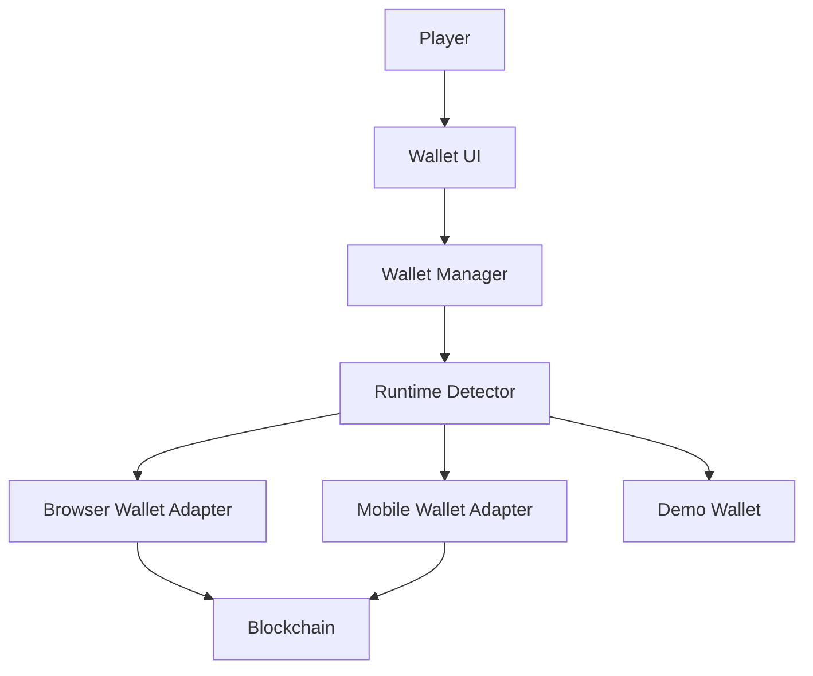

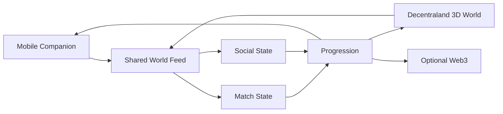

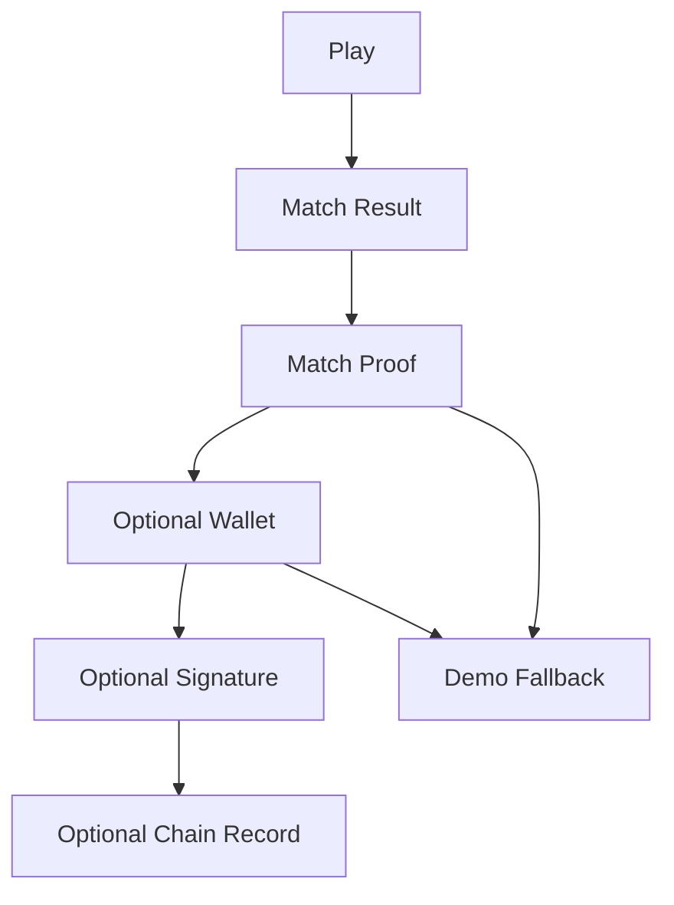

Wallet connection is implemented with runtime detection, guarded provider access, explicit rejection/timeout/network handling, retry behavior, and demo fallback. Live compatibility still depends on the installed wallet/runtime.

The Expo app is the mobile companion. The SDK7 World lives in `scene/` (production graphics) and `decentraland-world/` (isolated Friendzone layout). Scene code never imports React Native or `window.ethereum`.

### Data modes

- **demo** — all synthetic, deterministic, `origin: "demo"`
- **live** — backend / wallet data only
- **hybrid** (default hackathon) — real local player + seeded ambient crew. Never claims real platform-wide population.

Wallet troubleshooting: [docs/WALLET_TROUBLESHOOTING.md](docs/WALLET_TROUBLESHOOTING.md). World deploy: [docs/DECENTRALAND_WORLD_DEPLOYMENT.md](docs/DECENTRALAND_WORLD_DEPLOYMENT.md). Demo path: [docs/FINAL_DEMO_SCRIPT.md](docs/FINAL_DEMO_SCRIPT.md).

The most important boundary is:

```text
React Native UI
      ↓
Friendzone domain logic
      ↓
Persistence / network / platform adapters
```

That separation makes it possible to improve the visuals without rewriting gameplay logic and improve the backend without rewriting the UI.

---

## Client Architecture

The application uses Expo Router for navigation and a conventional React Native component architecture.

The Friendzone route is:

```text
app/(tabs)/friendzone.tsx
        ↓
components/friendzone/FriendzoneHub.tsx
        ↓
Friendzone component tree
        ↓
lib/friendzone/*
```

The tab layout adds Crew while retaining Home.

### Navigation

```tsx
<Tabs.Screen
  name="friendzone"
  options={{
    title: "Crew",
  }}
/>

<Tabs.Screen
  name="index"
  options={{
    title: "Home",
  }}
/>
```

This additive approach is important because the project can demonstrate the original game and the upgraded social experience without destroying the earlier path.

---

## Domain Architecture

The domain layer is exported from:

```text
lib/friendzone/index.ts
```

The index acts as a clean public surface for the Friendzone subsystem.

### Domain package map

```text
lib/friendzone/
├── accessibility.ts
├── actions.ts
├── analytics.ts
├── bridge.ts
├── clock.ts
├── constants.ts
├── demo.ts
├── error.ts
├── feature-flags.ts
├── ids.ts
├── index.ts
├── leaderboard.ts
├── migrations.ts
├── missions.ts
├── network-client.ts
├── network.ts
├── party.ts
├── performance.ts
├── profile.ts
├── queue.ts
├── reactions.ts
├── reducer.ts
├── retention.ts
├── scoring.ts
├── selectors.ts
├── share.ts
├── storage.ts
├── streaks.ts
├── telemetry.ts
├── types.ts
└── validation.ts
```

This structure is intentionally explicit. A future contributor can find the business rule they need without searching through a single 10,000-line application component.

---

## Server Architecture

The server exposes Friendzone room primitives under the tRPC router.

Current room procedures include:

```text
friendzone.createRoom
friendzone.getRoom
friendzone.joinRoom
friendzone.setReady
friendzone.pull
friendzone.reaction
friendzone.heartbeat
friendzone.resetRoom
```

The current server implementation keeps room state in memory.

That is a deliberate prototype boundary:

```text
Current prototype
    in-memory room map

Production path
    Redis / authoritative game service
              +
    persistent player/profile storage
```

The UI does not need to know which persistence layer is behind the contract.

---

# Data Model

## Friendzone Player

```ts
export interface FriendzonePlayer {
  id: string;
  displayName: string;
  team: Team;
  status: PresenceStatus;
  score: number;
  pulls: number;
  streak: number;
  ready: boolean;
  lastSeenAt: number;
}
```

### Responsibilities

* identity within the room
* team assignment
* online presence
* score/pull state
* readiness
* last-seen timestamp

---

## Friendzone Room

```ts
export interface FriendzoneRoom {
  id: string;
  code: string;
  visibility: RoomVisibility;
  maxPlayers: number;
  hostId: string;
  createdAt: number;
  expiresAt: number;
  phase: MatchPhase;
  round: number;
  timeRemainingMs: number;
  ropePosition: number;
  players: FriendzonePlayer[];
  recentReactions: Array<{
    id: string;
    playerId: string;
    reaction: Reaction;
    at: number;
  }>;
}
```

The room is intentionally self-contained enough for a lobby or synchronized room adapter to reconstruct the visible state.

---

## Match Result

```ts
export interface MatchResult {
  id: string;
  roomId: string;
  winner: Team;
  playerTeam: Team;
  pulls: number;
  durationMs: number;
  opponentPulls: number;
  personalBest: boolean;
  createdAt: number;
}
```

The result object is the bridge between gameplay and retention.

It is used to update:

* total matches
* wins/losses
* pulls
* streak/personal-best state
* daily missions
* the match recap

---

## Daily Mission

```ts
export interface DailyMission {
  id: string;
  title: string;
  description: string;
  target: number;
  progress: number;
  reward: number;
  completed: boolean;
}
```

This model is intentionally lightweight so missions can remain local-first during a demo.

---

## Snapshot

```ts
export interface FriendzoneSnapshot {
  profile: FriendzoneProfile;
  currentRoom: FriendzoneRoom | null;
  activity: ActivityItem[];
  results: MatchResult[];
  leaderboard: LeaderboardEntry[];
  network: NetworkHealth;
  hydratedAt: number;
}
```

The snapshot is the core persistence boundary for the mobile experience.

---

# State Machine

## Match Lifecycle

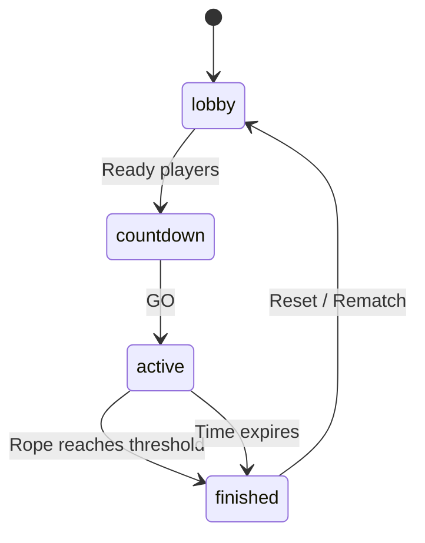

This makes the game state easy to reason about and makes it possible to attach UI behavior to a small set of well-defined phases.

---

# Game Mechanics

## Teams

The Friendzone mobile experience exposes two simple team identities:

* ☀️ **Sun Crew**
* 🌙 **Moon Crew**

The player chooses a preferred side before entering the arena.

The team is part of the player profile and also part of the room state.

---

## Pulling

The mobile arena translates touch interaction into discrete pull events.

The local reducer records:

* player ID
* team
* delta
* timestamp

Example action shape:

```ts
{
  type: "pull",
  playerId,
  team,
  delta,
  at: Date.now(),
}
```

The reducer updates the player's pull count, score, and activity timestamp without coupling this state transition to UI rendering.

---

## Streaks

Streaks reward rapid, consistent interaction.

The streak subsystem provides the foundation for:

* personal-best recognition
* mission progress
* visual momentum feedback
* future combo systems

The important design constraint is that the streak should feel like additional momentum, not a second game layered on top of the first one.

---

## Scoring

Scoring is isolated in `lib/friendzone/scoring.ts` so that balancing can be changed without changing the UI.

A future production balancing pass can replace the constants or formula while retaining the same result contracts.

---

# Friendzone Mechanics

## Room Creation

A room is created from a local player profile and given a short invite code.

The client generates the first visible social state immediately. This avoids a blank UI while the network layer is unavailable.

### Design goals

* fast
* readable
* shareable
* bounded lifetime
* invite-first
* safe fallback

---

## Room Joining

The demo client supports joining the currently represented room through the local state contract, while the optional HTTP adapter provides a path to a real backend.

The server contract validates:

* room code format
* room existence
* room expiry
* room capacity
* player identity

---

## Presence

Presence is intentionally visual and lightweight.

The client shows room members with status labels instead of relying only on color.

This is especially important on mobile because users may be viewing the app under poor brightness or different accessibility settings.

---

## Reactions

Supported quick reactions are intentionally minimal:

```text
⚡  🔥  👏  💪  🌙  ☀️
```

The purpose is not to create a full chat system; it is to create a fast social signal that works during a match or immediately after a match.

This is a good extension point for future emoji reactions, player stickers, team chants, or spatial reactions in a Decentraland scene.

---

# Mobile UX

## One-Thumb Arena

The `MobileArena` component is designed around a single primary action.

The most important button is intentionally large, high-contrast, and placed for comfortable interaction.

```text
┌─────────────────────────────┐
│        MATCH HUD            │
│                             │
│  ☀️  =======🪢=======  🌙   │
│                             │
│        ROPE POSITION        │
│                             │
│      ┌───────────────┐      │
│      │     PULL      │      │
│      └───────────────┘      │
│                             │
│     streak / feedback       │
└─────────────────────────────┘
```

The interaction is intended to feel immediate:

```text
Touch
  ↓
Haptic budget (throttled)
  ↓
Pull rate gate (70ms)
  ↓
Friendzone pull state
  ↓
Reanimated rope / press
  ↓
Streak feedback
```

The 136pt `PullControl` is the one-thumb primary. Existing screens can keep:

```tsx
import { MobileArena } from "@/components/MobileArena";
```

`MobileArena.tsx` re-exports `EnhancedMobileArena`, which applies Friendzone `lib/game-rules` rather than replacing them. High-frequency visual feedback runs in Reanimated; pull, reaction, surge, and haptic bursts are budgeted in `lib/mobile-ux`.

See `docs/MOBILE_UX_TOUCH_PERFORMANCE_25_PLUS_PAGES.md` for the full module map, and `docs/MOBILE_UX_TOUCH_PERFORMANCE_PATCH_NOTES.md` for what landed in this pass.

Development-only playground: `app/dev/mobile-ux-lab.tsx`.

---

## Mobile-First Content Hierarchy

The Crew screen prioritizes information in this order:

1. current room / crew state
2. network health
3. core social action
4. arena action
5. current result
6. missions
7. leaderboard
8. reset/debug controls

That ordering is intentional. The player should not need to scroll through secondary information before reaching the game.

---

# Accessibility

Accessibility is treated as a product requirement rather than a documentation item.

The Friendzone domain includes accessibility helpers and the UI avoids making color the sole carrier of meaning.

### Accessibility practices

* readable text labels for actions
* explicit semantic names on important controls
* large touch targets
* high-contrast primary actions
* text equivalents for status
* reduced reliance on tiny icon-only controls
* portrait-first layouts
* clear offline/degraded states

The architecture leaves room for future support for dynamic type, richer screen-reader hints, and user-level motion preferences.

---

# Offline-First Reliability

A hackathon demo is often run in an imperfect environment. The mobile architecture therefore treats connectivity as a variable instead of a prerequisite.

## Local snapshot

The current Friendzone snapshot can be serialized and restored from local persistence.

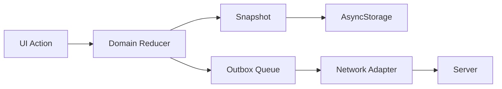

### Why local-first matters

Without local-first state, the failure sequence can look like:

```text
Network unavailable
    ↓
Room request fails
    ↓
Screen has no state
    ↓
Demo looks broken
```

With the current architecture:

```text
Network unavailable
    ↓
Local state remains available
    ↓
Network health is visible
    ↓
Actions can be queued where appropriate
    ↓
Core interaction remains demonstrable
```

---

## Network Health

The network model tracks:

```ts
export interface NetworkHealth {
  state: "offline" | "degraded" | "online";
  latencyMs: number | null;
  lastSuccessAt: number | null;
  retryCount: number;
  reason: string | null;
}
```

This gives the UI a truthful status layer instead of making a failed request look like a frozen screen.

---

# Networking

## API Boundary

The mobile UI talks to a domain-level client boundary rather than directly knowing about transport details.

That allows this migration path:

```text
Local demo adapter
        ↓
HTTP adapter
        ↓
tRPC router
        ↓
Production realtime service
```

The current `network-client.ts` provides an optional HTTP implementation.

---

## tRPC Server Contract

The server uses Zod-backed procedure inputs.

Example room validation:

```ts
const roomPlayerSchema = z.object({
  id: z.string().min(1).max(80),
  displayName: z.string().min(2).max(20),
  team: z.enum(["sun", "moon"]),
  status: z.enum(["online", "away", "offline"]).default("online"),
  score: z.number().finite().default(0),
  pulls: z.number().int().nonnegative().default(0),
  streak: z.number().int().nonnegative().default(0),
  ready: z.boolean().default(false),
  lastSeenAt: z.number().int().nonnegative().default(0),
});
```

This is preferable to trusting raw client input in a production architecture.

---

# Deep Links and World Bridging

Friendzone rooms are designed to be shareable.

The bridge module converts room identity into a stable deep-link representation and parses it back into normalized state.

Conceptually:

```text
Create Room
   ↓
Room Code
   ↓
Deep Link
   ↓
Friend / World / Share Surface
   ↓
Open Mobile App
   ↓
Parse Code
   ↓
Join Flow
```

The Android Expo configuration includes an app URL scheme and an intent-filter boundary for deep-link entry.

This creates a practical future bridge between:

* mobile companion
* Friendzone room
* Decentraland world
* invite/share surfaces

---

# Persistence and Migrations

The mobile snapshot is versionable.

The persistence layer includes migration support because app state should not become permanently coupled to the first schema that shipped.

A simple migration strategy is:

```text
Stored snapshot
      ↓
Parse / validate
      ↓
Detect version
      ↓
Run migrations
      ↓
Normalize
      ↓
Hydrate app
```

This matters for hackathon projects because local storage survives reloads and can otherwise make testing appear inconsistent after code changes.

---

# Analytics and Telemetry

The analytics layer is intentionally lightweight and local-friendly.

Core events include concepts such as:

* party creation
* party join
* pulls
* reactions
* match completion

The purpose is to answer product questions:

```text
Can people enter a room?
Can people start the game?
Do they finish matches?
Do they react?
Do missions progress?
Do they have a reason to rematch?
```

The telemetry module can also carry timing information for future network and performance instrumentation.

The architecture does **not** require a third-party analytics vendor for the core demo.

---

# Performance Strategy

Performance is important because the arena experience relies on frequent interaction and animation.

The project includes performance helpers and bounded data structures to avoid accidental growth.

## Bounded collections

Examples include:

* capped recent reactions
* capped match results
* capped activity history

This avoids a common mobile failure mode:

```text
Session starts
  ↓
Every action appends permanently
  ↓
Snapshot grows forever
  ↓
Persistence becomes expensive
  ↓
Hydration slows down
```

The current design instead uses explicit limits.

---

## Render discipline

The UI should prefer:

* local state changes only where needed
* stable callbacks
* derived selectors instead of repeated calculation
* bounded lists
* simple primitives for high-frequency interaction

Future optimization can add more aggressive memoization or a dedicated animation renderer without changing the domain layer.

---

# Security and Trust Boundaries

The project is designed so that room/server inputs can be validated independently from presentation.

Important trust boundaries include:

### Client → Server

Never trust:

* player names
* room codes
* scores
* pull deltas
* player identifiers
* readiness state

The included server schema validates ranges and enum membership.

### Local Storage

Persisted data should be treated as user-controlled state and revalidated on hydration.

### Production Multiplayer

A production authoritative server should calculate:

* legal pull deltas
* rate limits
* match progression
* win conditions
* timestamps
* reward eligibility

The current in-memory server is a prototype boundary, not a production anti-cheat system.

---

# Project Structure

```text
.
├── app/                         # Expo Router mobile companion
├── components/                  # React Native UI (wallet, world preview, arena)
├── lib/
│   ├── runtime/                 # web / ios / android / server detection
│   ├── blockchain/              # wallet adapters, network, match proof
│   ├── world/                   # 2D projection of the shared WorldFeed
│   ├── friendzone/              # companion re-exports of the shared protocol
│   ├── hybrid-world/            # existing 2D/3D demo universe
│   └── web3/                    # live contract helpers (browser/native only)
├── shared/
│   ├── friendzone-world-protocol.ts
│   └── demo-world.ts
├── server/                      # optional tRPC backend
├── decentraland-world/          # SDK7 3D World (this is the World)
├── scene/                       # compatibility SDK7 plaza
├── contracts/                   # optional Solidity suite
├── tests/
└── docs/
```

# Important Files

| File | Responsibility |
| --- | --- |
| `decentraland-world/src/index.ts` | SDK7 World bootstrap |
| `decentraland-world/scene.json` | SDK7 scene + Worlds NAME placeholder |
| `shared/friendzone-world-protocol.ts` | Shared 2D/3D protocol |
| `shared/demo-world.ts` | Canonical demo seed |
| `lib/runtime/platform.ts` | Runtime detection |
| `lib/blockchain/wallet/` | Wallet adapters and error normalization |
| `lib/world/projection.ts` | WorldFeed → mobile cards |
| `components/world/WorldEntryCard.tsx` | Companion Enter World surface |
| `components/friendzone/WorldMiniMap.tsx` | 2D mini-map from world positions |
| `components/wallet/WalletStatusCard.tsx` | Recoverable wallet UX |
| `app/(tabs)/index.tsx` | Mobile companion home |

---


---

# Implementation Details

## FriendzoneHub

`FriendzoneHub` acts as a UI orchestrator.

Its responsibilities are intentionally product-level:

* hydrate the Friendzone snapshot
* restore local state
* seed a deterministic crew for the demo when needed
* render the social surfaces
* trigger party actions
* launch the arena
* persist state changes
* show a human-readable status notice

It delegates actual domain behavior to `lib/friendzone/*`.

---

## Reducer-First State Changes

A representative state transformation looks like:

```ts
export function dispatchReaction(
  snapshot: FriendzoneSnapshot,
  reaction: Reaction,
): FriendzoneSnapshot {
  analytics.track("reaction_sent", { reaction });

  return reduceFriendzone(snapshot, {
    type: "reaction",
    playerId: snapshot.profile.playerId,
    reaction,
    at: Date.now(),
  });
}
```

The important property is that the state transition is deterministic and testable without mounting React.

---

## Match Completion

At the end of an arena round, the experience creates a `MatchResult` and updates:

```text
matches
wins
losses
pulls
best streak
mission progress
last active timestamp
results history
```

That result is then displayed by `MatchRecap`.

This gives the user immediate feedback about the outcome instead of silently changing counters in the background.

---

# Running Locally

## Prerequisites

Recommended environment:

* Node.js 18+
* pnpm 9+
* Expo CLI tooling through the project scripts
* iOS Simulator / Android Emulator for native testing, or a compatible Expo development workflow

The current project declares `pnpm@9.12.0` in `package.json`.

---

## Install

```bash
pnpm install
```

---

## Start development

```bash
pnpm dev
```

This runs the server and Metro processes together.

For the mobile/web Metro experience directly:

```bash
pnpm dev:metro
```

For the backend directly:

```bash
pnpm dev:server
```

---

## iOS

```bash
pnpm ios
```

## Android

```bash
pnpm android
```

---

## Web

The project is configured with Metro for web output.

```bash
pnpm dev:metro
```

Then use the Expo-provided development URL.

---

## Decentraland scene

The hackathon World is `decentraland-world/` (SDK7, `@dcl/sdk`):

```bash
cd decentraland-world
npm install
npm run start
npm run build
```

Replace `YOUR_WORLD_NAME.dcl.eth` in `decentraland-world/scene.json` before `npm run deploy`.

A compatibility plaza remains in `scene/` (`pnpm scene:start`). The React Native app does not embed the Decentraland engine.

---

Or from the repository root, after the scene dependencies are installed:

```bash
pnpm scene:start
```

To load the plaza in the **Decentraland mobile app**, put the phone on the same Wi-Fi and run `pnpm scene:start:mobile`, then scan the QR code. See `scene/README.md` for the mobile HUD, lighting, and input notes.

The 3D plaza is a 2×2 SDK 7 scene. It does not require the Expo app to preview. Tap the floor pad or the on-screen **PULL** control to tug; **RESET** restarts the 30-second demo match.

---

# Environment Configuration

The project includes a small environment loader and an Expo config that resolves the app bundle/deep-link identity.

The important production rule is:

> **Never hard-code secrets into the application bundle.**

Public configuration may be shipped to the client; private API keys, signing secrets, database credentials, and service tokens must remain server-side.

---

# Development Workflow

A practical workflow for contributors is:

```text
1. Change domain rule
2. Add/update deterministic test
3. Update selector/action if required
4. Update UI
5. Run unit tests
6. Run TypeScript check
7. Run lint
8. Test on portrait device
9. Test offline transition
10. Test the full demo loop
```

This prevents visual changes from accidentally changing game rules.

---

# Testing

## Test strategy

Tests are intentionally concentrated around deterministic business rules.

Current Friendzone test areas include:

```text
tests/friendzone/missions.test.ts
tests/friendzone/party.test.ts
tests/friendzone/retention.test.ts
tests/friendzone/scoring.test.ts
tests/friendzone/streaks.test.ts
tests/friendzone/validation.test.ts
```

The repository also retains the original project's broader test suite, including mobile UX/touch/performance:

```text
tests/mobile-ux-touch.test.ts
tests/mobile-ux-throttle.test.ts
tests/mobile-ux-performance.test.ts
tests/mobile-compatibility.test.ts
```

---

## Unit tests

Run:

```bash
pnpm test
```

Or the Friendzone subset:

```bash
pnpm test:friendzone
```

---

## TypeScript

```bash
pnpm check
```

---

## Lint

```bash
pnpm lint
```

---

## Full validation

```bash
pnpm validate:friendzone
```

The exact availability of all checks depends on local dependency installation and platform tooling.

---

# Mobile QA Checklist

Before submitting a mobile experience, test the following on an actual phone where possible.

## Navigation

* [ ] App launches without a blank state
* [ ] Home tab works
* [ ] Crew tab works
* [ ] Back navigation does not trap the user
* [ ] Portrait layout remains readable

## Social

* [ ] Room code is visible
* [ ] Copy invite works
* [ ] Share action has a fallback
* [ ] Presence renders correctly
* [ ] Reactions register immediately

## Gameplay

* [ ] Team choice works
* [ ] Arena opens
* [ ] Pull button is easy to hit with one hand
* [ ] Haptic interaction does not block gameplay
* [ ] Match completion is obvious
* [ ] Match recap is visible

## Retention

* [ ] Mission progress changes
* [ ] Result history updates
* [ ] Leaderboard shows a current-player row
* [ ] Retention/rematch message appears

## Reliability

* [ ] Offline state is visible
* [ ] Local snapshot restores after reload
* [ ] Network failure does not produce an unexplained blank screen
* [ ] Error state remains recoverable

---

# Production Multiplayer Path

The current in-memory room implementation is deliberately small. A production build can replace it with an authoritative realtime service.

Recommended architecture:

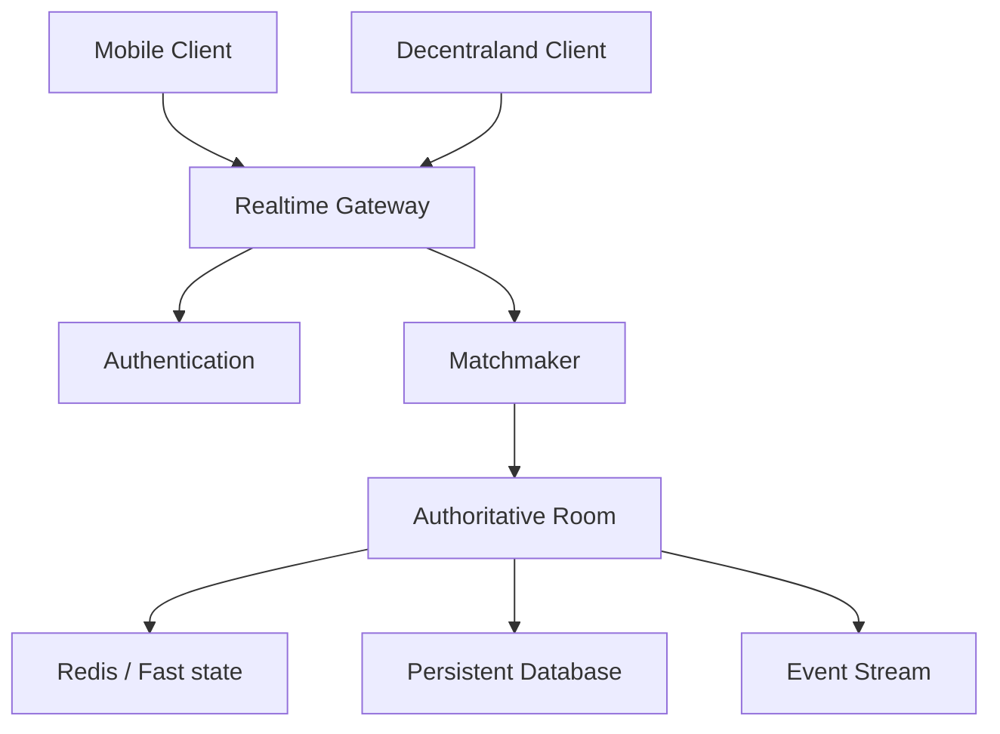

### Production responsibilities

#### Matchmaker

* find compatible players
* group parties
* balance teams
* prevent duplicate joins

#### Authoritative room

* calculate legal pull deltas
* apply time progression
* evaluate win conditions
* broadcast snapshots or patches
* reject invalid actions

#### Redis

Useful for:

* ephemeral room state
* presence
* queues
* fast leaderboards
* distributed locks

#### Database

Useful for:

* profiles
* match history
* statistics
* mission state
* achievements
* moderation logs

---

# Decentraland Integration Strategy

The mobile project is designed around a clean boundary to a Decentraland experience.

The intended architecture is:

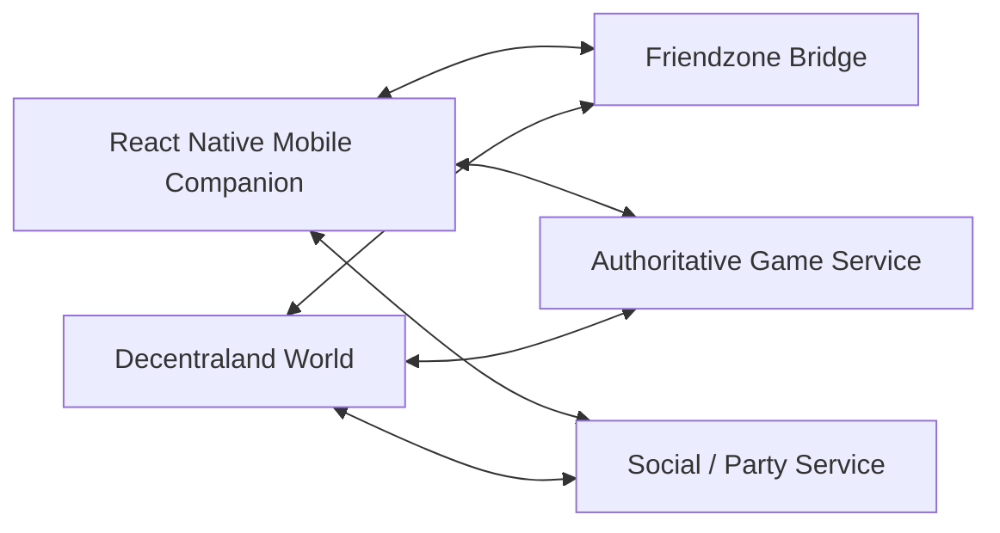

The mobile app can provide:

* quick invite entry
* room discovery
* mobile controls
* social context
* post-match progression

The world can provide:

* 3D arena presentation
* avatars
* spatial social interaction
* in-world spectacle
* world-based discovery

This division keeps the mobile interaction optimized for touch while allowing the metaverse layer to remain visually rich.

The Solidity suite in `contracts/` is the settlement and reward layer for that split: players join and stake FZONE on-chain, the mobile/tRPC loop remains the source of pull truth, and `TugOfWarArena` distributes prizes plus a VRF wearable after the operator posts the Sun/Moon result.

---

# 3D Arena Scene

`scene/` is a production SDK 7 plaza that complements the portrait mobile client.

It includes:

* a neon Sun/Moon arena with an entrance gate, crew pads, raised bases, pull/rematch pads, Friendzone board, and portals
* an in-world **DAO Governance Plaza** (proposal pedestals, workflow board, official DAO/Forum terminals)
* a live spline rope driven by the same `-44…44` pull range as the mobile game
* lobby → active → finished rounds, with MessageBus events and a mobile `worldBridge` contract
* placeholder crew avatars with idle, tap, celebrate, and defeat motion
* night skybox, one shadowed spotlight, and three point fills (parcel light cap)
* `ParticleSystem` sparkles, torch fire, rain/snow/fog, win fireworks, and one ambient cloud/sparkle system
* floating 3D HUD (title, status, timer, score, power bars) plus a 2D overlay
* a local demo session with a Colyseus-shaped transport boundary

Replace `YOUR-NAME.dcl.eth` in `scene/scene.json` before a Worlds deploy. The mapping layer in `scene/src/logic` is SDK-free and covered by `tests/scene-visuals.test.ts` and `tests/scene-world.test.ts`. Governance domain logic is covered by `tests/scene-governance.test.ts`. Preview with `pnpm scene:start` (see `scene/README.md`).

---

# Demo Mode

A hackathon environment benefits from a deterministic demo.

The project therefore includes demo data and a reset action.

## Demo seeding

When the local room only contains the local player, the hub can seed a small deterministic crew representation.

This prevents the most common empty-state demo failure:

```text
Judge opens app
  ↓
No backend connection
  ↓
No other players
  ↓
Empty lobby
  ↓
Nothing to show
```

Instead:

```text
Judge opens app
  ↓
Load local snapshot
  ↓
Seed recognizable crew state
  ↓
Show invite/presence/social signals
  ↓
Enter arena
```

This is presentation/demo data, not a claim that those users are real players.

The hybrid 2D + 3D demo universe in `lib/hybrid-world` (mobile companion) and `scene/src/hybrid` (Decentraland World) shares one seeded dataset. Walk through it with [docs/HYBRID_2D_3D_DEMO_RUNBOOK.md](docs/HYBRID_2D_3D_DEMO_RUNBOOK.md).

---

# Hackathon Demo Script

A strong short demo can fit in about a minute.

### 0–10 seconds — Explain the mechanic

Open Crew and say:

> “This is a one-thumb tug-of-war game designed around social competition.”

### 10–20 seconds — Show the room

Point to:

* room code
* presence
* reaction controls

Say:

> “Players can create a room, invite friends, and see the crew state before they start.”

### 20–40 seconds — Play

Choose a team and enter the arena.

Demonstrate the large pull control and the streak feedback.

### 40–50 seconds — Show the result

Finish the match and immediately show:

* winner
* pulls
* personal-best state
* updated stats

### 50–60 seconds — Show retention

Scroll just far enough to show:

* mission progress
* leaderboard
* rematch/return signal

The narrative becomes:

```text
Game mechanic
    +
Social room
    +
Mobile interaction
    +
Progression
    +
Return loop
```

That is a much stronger product story than a standalone mini-game.

---

# Submission Positioning

The public repository is positioned as:

> **A hybrid Friendzone experience: React Native companion + Decentraland SDK7 3D World. Web3 is optional.**

The repository should clearly distinguish between:

### Implemented in this codebase

* Expo / React Native mobile experience
* Crew social hub
* room model and invite code flow
* presence UI
* reactions
* mobile arena interaction
* missions
* result recap
* leaderboard presentation
* retention messaging
* local persistence
* network health state
* deep-link primitives
* optional tRPC room server
* Decentraland SDK 7 3D arena (rope, lighting, particles, HUD, DAO Governance Plaza)
* domain tests

### Architecture prepared for production

* realtime authoritative multiplayer
* Redis room state
* persistent player storage
* richer social graph
* scalable matchmaking
* Decentraland world bridge

### Future / roadmap

* production matchmaking
* real cross-device realtime synchronization
* persistent social graph
* anti-cheat infrastructure
* richer Decentraland world systems
* cosmetics
* seasonal content

Reward contracts (FZONE, wearables, operator-settled arena) and on-chain tournament brackets now live in `contracts/`.

This separation is important for trustworthy open-source documentation.

---

# Limitations and Honest Scope

This repository is a hackathon-oriented mobile build with a production-minded architecture, not a claim that every conceptual service is already deployed.

### Current limitations

1. The Friendzone server room state is in-memory.
2. The local mobile experience is designed to remain usable even when multiplayer infrastructure is unavailable.
3. The HTTP multiplayer adapter is a boundary for integration rather than proof of global-scale realtime infrastructure.
4. High-frequency pulls are not posted on-chain. The `contracts/` suite settles matches through a match operator (the game server). The Expo demo keeps minting optional until `lib/web3/addresses.ts` is populated from a deploy.
5. High-frequency pulls are not posted on-chain. Optional match proofs hash a finished result off-chain.
6. The React Native app is the mobile companion. The SDK7 World is `decentraland-world/`. Preview it with `npm run start` there.
7. The native Decentraland client currently does not run on mobile devices.
8. The DAO Governance Plaza is a discovery/education layer. Binding votes stay on [governance.decentraland.org](https://governance.decentraland.org/).

Being explicit about these boundaries improves the credibility of the project.

---

# Roadmap

## Phase 1 — Hackathon reliability

* [x] Friendzone Crew tab
* [x] Room code flow
* [x] Social reactions
* [x] Presence presentation
* [x] One-thumb arena
* [x] Missions
* [x] Match recap
* [x] Leaderboard presentation
* [x] Retention prompt
* [x] Local persistence
* [x] Offline/network state
* [x] Domain tests
* [x] Decentraland SDK 7 3D arena scene

## Phase 2 — Realtime multiplayer

* [ ] WebSocket/Colyseus or equivalent authoritative rooms
* [ ] party matchmaking
* [ ] real-time presence
* [ ] authoritative pull validation
* [ ] reconnect/resume
* [ ] server-driven match timer

## Phase 3 — Social graph

* [ ] friend requests
* [ ] crew membership
* [ ] player profiles
* [ ] activity feed
* [ ] private/direct social channels
* [ ] party history

## Phase 4 — Decentraland world integration

* [x] 3D plaza, spline rope, crew avatars, lighting, and VFX (`scene/`)
* [ ] world-side room discovery
* [ ] in-world party portals
* [ ] avatar-linked player identity
* [ ] spatial reactions
* [ ] shared world scoreboard
* [ ] live Colyseus/mobile handoff into the scene

## Phase 5 — Long-term engagement

* [ ] seasonal competitions
* [ ] tournaments
* [ ] achievements
* [ ] cosmetics
* [ ] team banners
* [ ] creator-generated arenas
* [ ] richer progression systems

---

# Contributing

Contributions are welcome.

Before opening a pull request:

```bash
pnpm install
pnpm test
pnpm check
pnpm lint
```

For gameplay changes, include a test covering the changed rule whenever practical.

For UI changes, check portrait layouts and at least one real mobile device or simulator.

### Suggested PR structure

```text
Problem

What changed

Why this architecture

Testing performed

Mobile QA performed

Known limitations
```

---

# License

This project is licensed under the MIT License. See [`LICENSE`](LICENSE).

---

# Repository

Primary GitHub repository:

`https://github.com/lucylow/Tug-of-War-Arena`

---

# Final Architecture Summary

The strongest way to think about this repository is not as “a tug-of-war button.”

It is a small social game platform built around a highly legible mechanic.

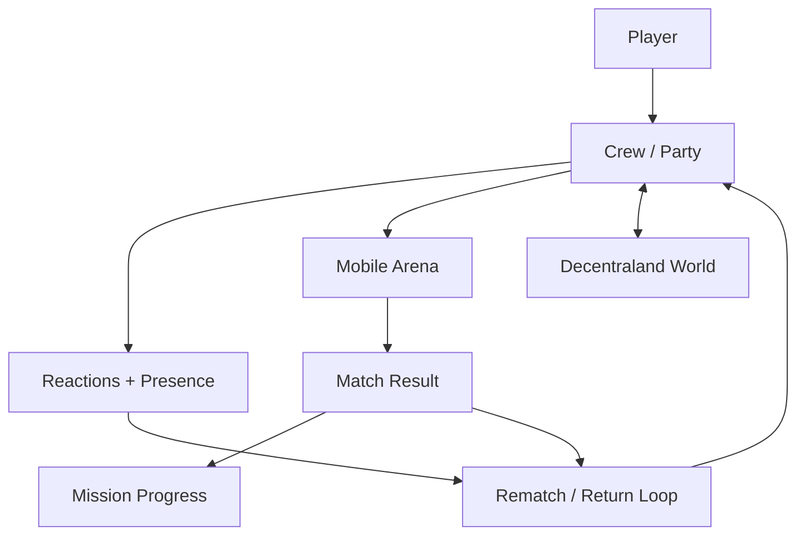

The result is a product architecture with four clear layers:

```text
1. Touch interaction
2. Competitive game state
3. Social state
4. Persistent return loop
```

That structure is the main value of the Friendzone upgrade: the project is designed not only to demonstrate a game mechanic, but to demonstrate a **social mobile experience that can grow into a connected metaverse game**.
