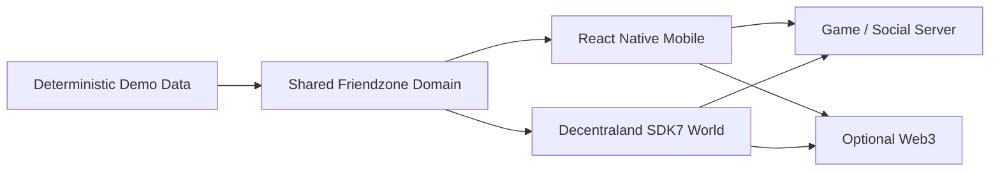
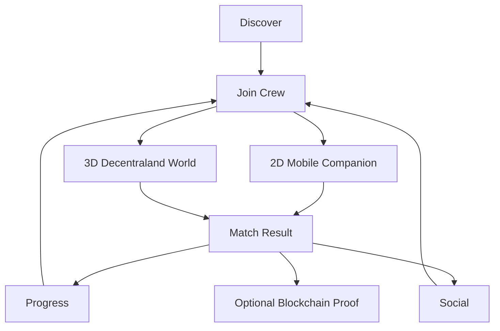

# Mobile + 3D Hybrid Architecture

Tug of War Arena: Friendzone has two clients that share one Friendzone domain.

1. **React Native / Expo** — portrait companion (crew, rooms, missions, wallet status, World preview).
2. **Decentraland SDK7 World** — spatial 3D destination (`decentraland-world/`).

The native Decentraland client currently does not run on mobile devices. The mobile app must not claim to embed the Explorer.

Shared protocol: `shared/friendzone-world-protocol.ts`  
Canonical demo seed: `shared/demo-world.ts`  
Mobile projection: `lib/world/projection.ts`
